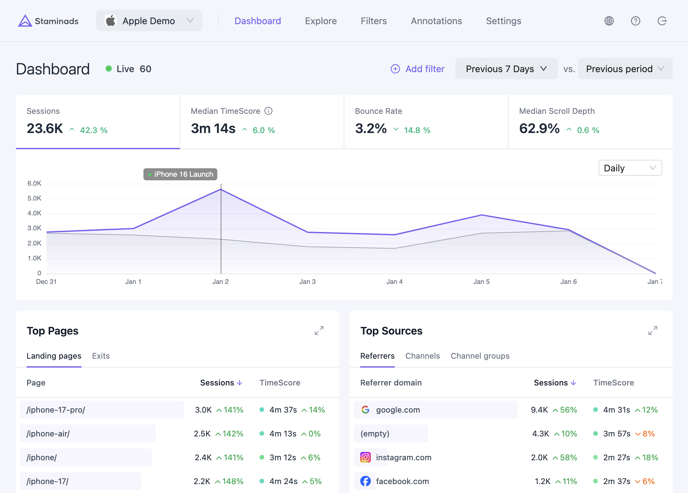

# Staminads

**Stop chasing conversions you can't track. Start measuring engagement you can trust.**

Cookies are dead. Meet TimeScore — the metric that actually works.

😱 **[Try the live demo →](https://demo.staminads.com/login?email=demo@staminads.com&password=demodemo)**

## What is TimeScore?

TimeScore is the median time visitors spend on your site, broken down by traffic source. Unlike bounce rates or page views, it measures actual engagement — and uses medians to resist outlier distortion.

## Features

- **TimeScore Metrics** — Median engagement time that actually reflects visitor quality
- **Privacy-First** — No cookies, no consent banners, no PII. 100% traffic capture
- **AI Assistant** — Query your data in plain English
- **Deep Exploration** — Drill down by any dimension: UTM, country, device, custom dimensions
- **Multi-Tenant** — Workspaces with team roles (Admin, Editor, Viewer)
- **Real-Time** — Live dashboard with visitor map
- **Goals & Conversions** — Track custom goals with values
- **Custom Dimensions** — Up to 10 custom data points per session

## Quick Start

See the [documentation](https://docs.staminads.com) for installation and setup instructions.

## Tech Stack

- **Backend**: NestJS + TypeScript
- **Frontend**: React + Ant Design
- **Database**: ClickHouse (sub-50ms queries)

## Issues

Found a bug? [Report an issue](https://github.com/staminads/staminads/issues)

## License

[AGPL-3.0](LICENSE)
